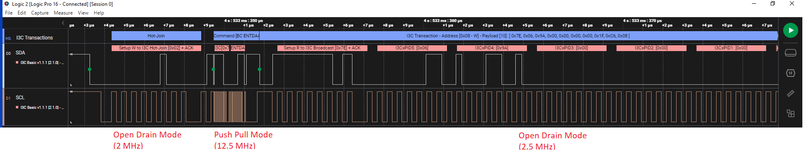

# Getting Started with I3C Using PIC18F16Q20 Microcontroller

## Introduction
This example demonstrates the different features of the Improved Inter-Integrated Circuit® (I3C) Target peripheral of PIC microcontroller. The example comprises six MPLAB X projects, each showcasing the various features of the I3C Target module, as listed below.

| Project| Description|
|:------|:------------|
|[Hot-Join Request to I3C Controller](pic18f16q20-i3c-hot-join.X) | This Project demonstrates the Hot-Join(HJ) feature of the I3C Target module by sending a HJ request to the I3C  Controller.
| [Private Transaction (Read/Write)](pic18f16q20-i3c-private-transaction.X) | This Project demonstrates exchange of data between the Controller and the Target using Private Read and Private Write. |
| [In-Band Interrupt to I3C Controller (With and Without payload)](pic18f16q20-i3c-in-band-interrupt.X)| This Project demonstrates how the I3C Target can transmit data to the I3C Controller using In-Band interrupt.|
| [Reset (as per MIPI recommendation)](pic18f16q20-i3c-reset.X) | This Project showcases different types of resets that can be performed on the Target by the Controller.|
| [Bus error](pic18f16q20-i3c-bus-error.X) | This Project showcases different types of Bus Errors that can be detected by the Target.|
|[Firmware support for CCCs](pic18f16q20-i3c-ccc.X) |This project showcases detection of Common Command Codes(CCC) and performing required action in the firmware. |

## Block Diagram

*Note:* The DMA channels are required only when the I3C driver is I3C_Target_DMA driver.

## Related Documentation
- [PIC18F16Q20 Product Page](https://www.microchip.com/product/PIC18F16Q20)
- [PIC18F16Q20 Data Sheet](https://www.microchip.com/DS40002387)
- [(TB3340) Using the I3C® Target Module on 8-bit PIC® Microcontrollers](https://www.microchip.com/DS90003340)

## Software Used
- [MPLAB® X IDE v6.15](https://www.microchip.com/mplab/mplab-x-ide) or newer
- [XC8 Compiler 2.45](https://www.microchip.com/mplab/compilers) or newer
- [MPLAB® Code Configurator (MCC) 5.3.7](https://www.microchip.com/mplab/mplab-code-configurator) or newer
- [Microchip PIC18F-Q Series Device Support 1.22.413](https://packs.download.microchip.com/) or newer
- [Binho I3C Plugin for Saleae Logic](https://binho.io/pages/i3c-basic-protocol-analyzer)

**NOTE:** PIC18F16Q20 Curiosity Nano customers will get a free 45-day trial license of Binho I3C Plugin for Saleae Logic.

## Hardware Used
- [PIC18F16Q20 Curiosity Nano Board](https://www.microchip.com/en-us/development-tool/EV73T25A)
- Any I3C Controller
- [Saleae Logic Analyzer](https://www.saleae.com/)

## Setup

In this example, PIC18F16Q20 is used as the I3C Target device.
1. Connect the I3C Serial Data (SDA) and I3C Serial Clock (SCL) pins of PIC18F16Q20 to the SCL, SDA pins of the Controller, respectively.
2. Connect the I3C bus SCL and SDA pins to the I3C Protocol Analyzer to observe transactions in the bus.

### Pin Connection Table
|Microcontroller Pin| Signal Description |
|:------------------:|:-----------------:|
| RC0| I3C SCL|
| RC1 | I3C SDA |
| RC4 | UART TX |
| RA2 | Switch - SW0 |

## Peripheral Configuration Using MCC

This section explains the peripheral configuration using the MPLAB® X IDE with MCC plug-in required to recreate the project. The configurations are same for all the projects. The configurations specific to a project are mentioned when required.

Refer to the [Software Used](https://github.com/microchip-pic-avr-examples/pic18f16q20-i3c-getting-started-mplab-mcc#software-used) section to install the required tools to recreate the project.

Additional Links: [MCC Melody Technical Reference](https://onlinedocs.microchip.com/v2/keyword-lookup?keyword=MCC.MELODY.INTRODUCTION&redirect=true)

##### Peripheral Configuration Summary

| Peripherals               | Configuration                                                                                                                                                                                                                                                                                                                                                                                                  | Usage                                                                         |
|---------------------------|----------------------------------------------------------------------------------------------------------------------------------------------------------------------------------------------------------------------------------------------------------------------------------------------------------------------------------------------------------------------------------------------------------------|-------------------------------------------------------------------------------|
|    Clock Control    |    Clock source –   HFINTOSC HF Internal Clock – 64 MHz Clock Divider   – 1                                                                                                                                                                                                                                                                                                         |    System  clock                                                                     |
|    I3C_Target_DMA |  **I3C1 Driver**   Tx DMA Channel Selection - DMA1  Rx DMA Channel Selection - DMA2  I3C PLIB Selector - I3C1  *Transaction settings*  Hot-Join Capable - Enable (for HJ and Reset project)   Default Private Transaction Acknowledge - Acknowledge    **I3C1 PLIB**   Enable Module Clock source - Fosc Input Buffer (SDA and SCL Pins) - I3C Fast Schmitt Trigger (FST) Buffer   *System Level Interrupt Settings* Enable General Interrupt   Enable Reset Interrupt (for Reset Project)   Enable Error interrupt (for CCCs and Bus Error Project)   *Module Level General Interrupt Callback Settings*  Enable Supported CCC Received Interrupt (for  CCCs Project)   *Module Level Error Interrupt Callback Settings*  Enable Unsupported CCC Received Interrupt (for  CCCs Project)  Enable Bus Error (TE0-TE6 Error) Interrupt (for Bus Error Project)   *Note: All the other configurations are retained with default selections*| Used as I3C Target|
|	 Pin Settings		  |    **Pin Grid View**  I3C1 I3C1SCL : RC0  I3C1SDA : RC1   UART1 TX1 : RC4  GPIO (used only for Hot-Join, IBI and Reset projects)  Input : RA2    **Pins** (used only for Hot-Join, IBI and Reset projects)  Custom Name: SW0 (for RA2 pin)   					|    Pin Configurations																	|                                                          
|    UART1                | **UART1 Driver**   Requested Baudrate – 9600  Enable Redirect Printf to UART  UART PLIB Selector – UART1        **UART1 PLIB**    Enable Transmit  Enable UART|    Send data to PC terminal   |
|    Configuration Bits                | **CONFIG7**   VDDIO2 supply mode bit - Standard Operating Range (VDDIO2 >= 1.62V)  Update this to low-voltage operating range if VDDIO2 < 1.62 V   |    Configuration Register|

**NOTE:** The on-board debugger present on Curiosity Nano board has a virtual serial port (CDC) connected to UART on the PIC18F16Q20, and provides an easy way to communicate with the target application through terminal software. Refer to the [Curiosity Nano board user guide](https://www.microchip.com/DS50003588) for more details.

## Projects:

For all the projects, the I3C bus is configured with a Push-Pull frequency of 12.5 MHz and Open-Drain frequency of 2 MHz.

### 1. Hot-Join request to I3C Controller
The I3C's Hot-Join (HJ) feature allows the Target to join the I3C bus even after the bus is configured and dynamic address is assigned to other devices on the bus. This feature is used when the Target is physically inserted into the bus or when the Target is mounted on the I3C bus, but it is depowered during the dynamic address assignment by the controller. In this configuration, the Target will not participate in the dynamic address assignment and will not have a dynamic address until HJ is requested by the Target. When a HJ is requested by the Target, the Controller assigns dynamic address.

Refer data sheet for more details.

#### Operation
-	Operating mode of the I3C bus is monitored.
-	Press switch SW0 to send a HJ request from Target using `I3C_Target_HotJoinRequest()` API. This will return all the errors that occur during the HJ request operation.
-	The status of the HJ request is monitored using `I3C_Target_HotJoinStatusGet()` to check whether the dynamic address is assigned or not.

##### Transaction

##### Terminal

### 2. Private Transaction (Read/Write)
After the dynamic address is assigned to the Target and the bus is in I3C mode, the Controller can directly communicate to the Target by sending its dynamic address. The Controller uses a Private Write transaction to write data to the Target directly and a Private Read transaction to read data directly from the Target.

Refer data sheet for more details.

#### Operation
- The Target waits until the controller assigns the dynamic address.
-	The Target configures the buffer and keeps it ready to receive data from the Private Write transaction using `I3C_Target_BufferReceive()` API.
-	The Controller initiates a Private Write transaction with the Target address and data to be written. The Target receives the data and stores in the buffer.
-	After receiving the data, the next private transaction is acknowledged using `I3C_Target_NextPrivateTransactionACK()` API.
-	The Target configures the buffer for the next private read request by Controller using `I3C_Target_BufferTransmit()` API. The Target cannot initiate a transaction to send the data to the controller. Instead, it keeps the data ready to be transferred when requested by the Controller.
-	The Controller initiates a Private Read transaction by sending the target's dynamic address and the number of bytes to be read. The Target sends the data upon this transaction request.
- After transmitting the data, the next private transaction is acknowledged using `I3C_Target_NextPrivateTransactionACK()` API.

##### Transaction
###### Dynamic Address Assignment
Dynamic Address is assigned to the Target by the Controller.

###### Private Write
The Controller Writes the data to the Target.

###### Private Read
The Controller reads the data from the Target.

##### Terminal

### 3. In-Band Interrupt to I3C Controller (with and without payload)
The I3C Target devices can generate an interrupt to the Controller using the SDA/SCL lines without any external interrupt lines using IBI feature. The Target sends a mandatory data byte followed by payload after the Controller ACKs the IBI request by Target. IBI cannot be generated after restart because address after restart is not arbitrated, only after the start it is arbitrated.

Refer data sheet for more details.

#### Operation
-	The Target waits until the controller assigns the dynamic address.
- In this example, switch SW0 is used to initiate the IBI request from the Target.
-	Mandatory byte must be configured first and is set using `I3C_Target_IBIMandatoryDataByteSet()` API.
-	Upon switch press, Targets sends an IBI request with mandatory byte and payload using `I3C_Target_IBIRequest()` API. The Target monitors the IBI status.
-	Next switch press, the Target sends an IBI request without the payload (only mandatory byte is sent) using `I3C_Target_IBIRequest()` API. The Target monitors the IBI status.

##### Transaction
###### IBI With Payload
IBI request is sent by the Target with a payload of 20 bytes.
  

###### IBI Without Payload
IBI request is sent by the Target without any payload.

##### Terminal

### 4. Reset (as per MIPI recommendation)
The Target Reset mechanism, as specified in the MIPI specification, allows the Controller to reset one or multiple Targets on the bus. The Target can be configured to perform different levels of reset, such as reset of the I3C Target module, reset of entire Target device or no reset when it receives a Target Reset Pattern from the Controller. The Target Reset Pattern consists of fourteen SDA transitions while SCL is kept low. The Controller uses the RSTACT CCC to configure which targets need to be reset, the level of reset to be used, and which targets are not to be reset.

Refer data sheet for more details.

#### Operation
- The Target initiates a HJ request upon switch press of SW0 and waits until dynamic address is received.
- After the Target is in I3C mode, it monitors whether a reset pattern is received from the controller.
- If the Target Reset Pattern is received after being configured by RSTACT CCC -
   - If the reset action is 'No Target Reset' , the Target ignores the reset pattern and the corresponding message is printed.
   - If the reset action is 'Reset the I3C Target module only', the I3C Target peripheral is reset using `I3C_Target_PeripheralReset()` and re-initialized using `I3C_Target_Initialize()`. HJ is then requested for dynamic address assignment upon switch press of SW0.
   - If the reset action is 'Reset the entire Target device', the Target device is reset.
- If the Target Reset Pattern is received without RSTACT CCC –
   - On receiving the first reset pattern, the I3C Target module is reset using `I3C_Target_PeripheralReset()` and re-initialized using `I3C_Target_Initialize()`. HJ is the requested for dynamic address assignment upon switch press of SW0.
   - On receiving reset pattern for the second time, the Target device is reset.

##### Transaction
###### Target Reset Pattern received after RSTACT CCC
RSTACT CCC with a Defining Byte of 0x00 is sent to the Target to ignore the Target Reset Pattern received. Similarly, RSTACT CCC is sent with Defining Byte 0x01, 0x02 followed by Target Reset Pattern.

###### Target Reset Pattern received without RSTACT CCC
The Target receives a reset pattern without any RSTACT CCC.

##### Terminal

### 5. Bus Error
The Target device supports the detection of seven errors that can possibly occur on the bus and their recovery methods specified in the MIPI I3C specification. The errors include: TE0,TE1,TE2,TE3,TE4,TE5,TE6.

Refer data sheet  for more details.

#### Operation
-	Various bus errors are generated by the Controller.
-	Target monitors and identify bus errors using `I3C_Target_BusErrorCallbackRegister()`.

##### Transaction
###### Bus Error - TE0
Occurs due to invalid Broadcast Address or Dynamic Address. The Controller sends an invalid combination of Broadcast Address (7’h7C / W).

The Controller sends HDR Exit Pattern for error recovery.

######  Bus Error - TE1
Occurs when the Target receives an invalid CCC code from the Controller. Similar to TE0, the Controller sends HDR Exit Pattern for error recovery.

######  Bus Error - TE2
Occurs when the Target receives an invalid write data from the Controller.

######  Bus Error - TE3
Occurs when the Target receives an invalid assigned address during the
Dynamic Address Assignment procedure.

######  Bus Error - TE4
Occurs when the Target receives an illegally formatted data following a Restart during Dynamic Address Assignment by the Controller. For example, the Controller sends 7’h7E/W after a Restart condition to inject TE4 error.

######  Bus Error - TE5
Occurs when the Target receives an illegally formatted CCC frame from the controller. For example, the Controller sends a Dynamic Address/W during GETBCR CCC to inject TE5 error.

##### Terminal

### 6. Firmware support for CCCs
The Common Command Code (CCC) are globally standardized commands that a Controller can transmit to a specific Target (direct CCC) or to all Targets on bus (Broadcast CCC). All supported CCCs are fully handled by I3C Target Module. This example showcases firmware support for all the supported and unsupported CCCs.

Refer data sheet for more details.

#### Operation
-	The Target waits until the controller assigns the dynamic address.
- The Controller sends CCCs to the Target.
-	The Target monitors if any unsupported CCC is received using I3C_Target_UnsupportedCCCReceivedCallbackRegister() API.
- The Target monitors if any supported CCC is received using I3C_Target_SupportedCCCReceivedCallbackRegister() API.

##### Transaction
###### Supported CCC (SETMWL)

###### Unsupported CCC (ENTAS0)

##### Terminal
  

## Summary
 The different features of I3C Target module such as HJ, Private Transaction, IBI, Reset, Bus Error and CCC are implemented using PIC18F16Q20.

 

 
Appendix

### MCC Configuration of I3C_Target_DMA Driver

#### I3C TARGET DMA
 
 

*NOTE:*
1. Enabled only for HJ, Reset Projects.

#### I3C PLIB
 
 
 

*NOTE:*
1. Enabled only for CCCs Project.
2. Enabled only for Bus Error Project.

